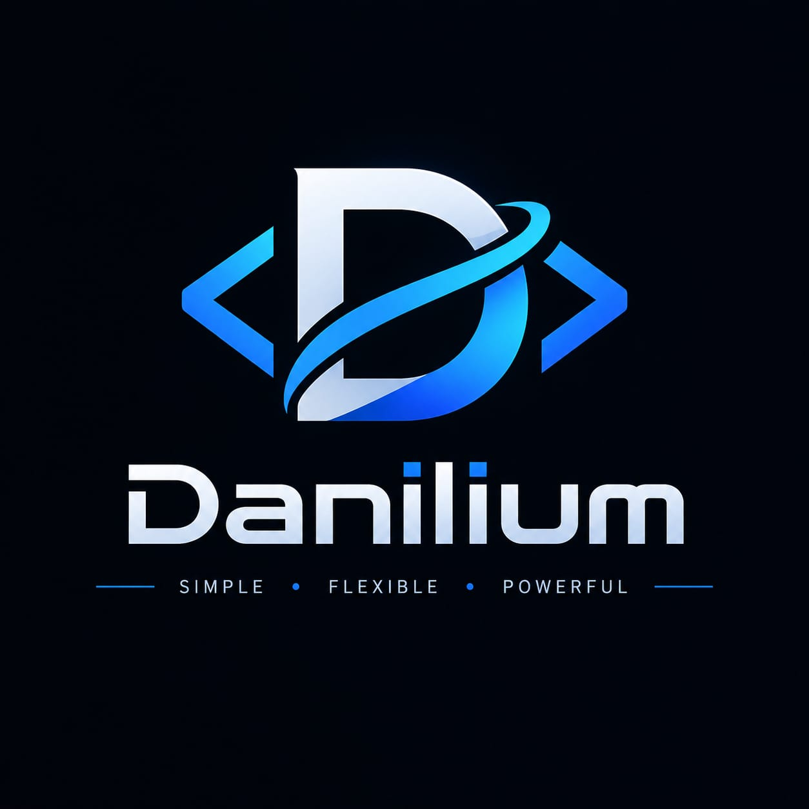

<div align="center">



# Danilium

### SIMPLE • FLEXIBLE • POWERFUL

**A programming language designed to be easy to learn and powerful enough to build anything.**

[]()
[]()
[]()

</div>

---

# 🚀 About Danilium

**Danilium** is an experimental programming language designed around one simple idea:

> **Make programming easy to learn without limiting what developers can build.**

Danilium aims to provide a **low floor and a high ceiling**.

Beginners should be able to quickly understand the basics of the language, while experienced developers should eventually be able to build complex software such as:

- ⚡ High-performance applications
- 🖥️ System software
- 🌐 Network services
- 🤖 AI systems
- 🎮 Game engines
- 🗄️ Databases
- 🔗 Distributed systems
- 🧠 Runtimes and virtual machines
- 🔧 Developer tools

---

# 🧠 Philosophy

Danilium follows three core principles:

## SIMPLE

The language should be easy to understand.

Simple programs should look simple:

```danilium
run("Hello, World!")
```

## FLEXIBLE

Danilium is designed to be flexible enough for different programming tasks.

The language should remain readable whether you are writing a small script, a web service, a game, or a complex system.

The goal is to provide a simple foundation that can grow with the developer.

---

## POWERFUL

Simple syntax should not mean limited capabilities.

Danilium is designed with the long-term goal of supporting complex software, including:

* ⚡ High-performance applications
* 🖥️ System software
* 🌐 Network services
* 🤖 AI systems
* 🎮 Game engines
* 🗄️ Databases
* 🔗 Distributed systems
* 🧠 Runtimes and virtual machines
* 🔧 Developer tools

Danilium should make it possible to start with a few simple lines and eventually build large, complex systems.

---

# 🛠️ Current Status

Danilium is currently in active development.

## Danilium 0.1

Danilium 0.1 is the first real implementation of the language.

It contains its own:

* Lexer
* Parser
* Abstract Syntax Tree (AST)
* Type checker
* Interpreter

The implementation does **not** use Python's `eval()` or similar shortcuts to execute Danilium programs.

The current goal is to establish a solid language architecture that can be expanded in future versions.

---

# 💻 Example

A basic Danilium program:

```danilium
name = "Danilium"
age = 20
active = true

run(name)
run(age)

if active == true:
    run("Danilium is running")
else:
    run("Danilium is inactive")
```

The syntax is intentionally simple and readable.

Danilium is currently focused on building a solid foundation for the language.

---

# 🏗️ Architecture

The current Danilium execution pipeline is:

```text
Danilium source code
        ↓
      Lexer
        ↓
      Parser
        ↓
       AST
        ↓
   Type Checker
        ↓
   Interpreter
        ↓
      Output
```

Each stage has its own responsibility.

This architecture keeps the language implementation modular and makes it easier to experiment with its design.

---

# 📦 Project Structure

```text
danilium/
├── danilium.py
├── lexer.py
├── parser.py
├── ast_nodes.py
├── type_checker.py
├── interpreter.py
├── examples/
└── README.md
```

---

# 🚀 Running Danilium

Clone the repository and run a Danilium program:

```bash
git clone https://github.com/mozaika228/danilium.git
cd danilium

python3 danilium.py examples
```

---

# 🗺️ Roadmap

Danilium is being developed incrementally.

Current areas of development include:

* Language syntax
* Type system
* Functions
* Collections
* Control flow
* Modules
* Standard library
* Runtime architecture
* Performance

The roadmap may change as the language evolves.

---

# 🌎 Long-Term Vision

Danilium is more than an experiment in syntax.

Its core idea is simple:

> **Make programming easy to learn without limiting what developers can build.**

Danilium aims to maintain a **low floor and a high ceiling**.

A beginner should be able to understand simple Danilium code without unnecessary complexity.

At the same time, the language should remain open to deeper programming concepts as the developer progresses.

Danilium starts simple.

The rest is built step by step.

**Simple to learn. Flexible to use. Powerful to build.**
